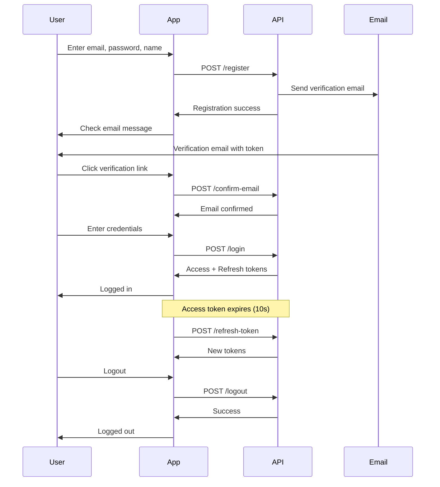

## Overview

The password reset flow consists of two steps:
1. **Request Reset**: User requests a password reset by providing their email
2. **Change Password**: User submits the token and new password to complete the reset

This page documents both endpoints used in the password reset process.

---

# Request Password Reset

<Note>
  **Endpoint:** `POST /api/auth/no-auth/request-reset-password`
</Note>

Initiate the password reset process by requesting a reset token. A password reset email will be sent to the provided email address if it exists in the system.

## Request

### Body Parameters

<ParamField body="email" type="string" required>
  Email address of the account to reset. A reset token will be sent to this email if the account exists.
</ParamField>

## Response

<ResponseField name="code" type="number">
  HTTP status code indicating the result
  - `200`: Reset email sent successfully
  - `400`: Email not registered in the system
</ResponseField>

<ResponseField name="message" type="string">
  Human-readable message describing the result
</ResponseField>

<ResponseField name="state" type="string">
  State field (currently unused but part of the response structure)
</ResponseField>

## Examples

<CodeGroup>

```bash cURL
curl -X POST https://api.rescuers.com/api/auth/no-auth/request-reset-password \
  -H "Content-Type: application/json" \
  -d '{
    "email": "user@example.com"
  }'
```

```javascript JavaScript
const requestPasswordReset = async (email) => {
  const response = await fetch(
    'https://api.rescuers.com/api/auth/no-auth/request-reset-password',
    {
      method: 'POST',
      headers: {
        'Content-Type': 'application/json',
      },
      body: JSON.stringify({ email })
    }
  );

  const data = await response.json();
  return data;
};

// Usage
const result = await requestPasswordReset('user@example.com');
if (result.code === 200) {
  console.log('Reset email sent! Check your inbox.');
} else {
  console.error(result.message);
}
```

```python Python
import requests

response = requests.post(
    'https://api.rescuers.com/api/auth/no-auth/request-reset-password',
    json={'email': 'user@example.com'}
)

data = response.json()
if data['code'] == 200:
    print('Reset email sent!')
else:
    print(f"Error: {data['message']}")
```

</CodeGroup>

### Success Response

```json
{
  "code": 200,
  "message": "Email de reseteo enviado. Revise el correo para reestablecer la contraseña",
  "state": ""
}
```

### Email Not Found Response

```json
{
  "code": 400,
  "message": "El email no esta registrado",
  "state": ""
}
```

## Implementation Details

<Note>
  **Source Reference:** `src/controllers/user/user.controller.ts:128-138` and `src/services/user/user.service.ts:247-269`
</Note>

When a password reset is requested:
1. System looks up the user by email
2. If found, generates a 16-character random token
3. Stores the token in the user's `emailConfirmationToken` field
4. Sends a password reset email with the token
5. Token remains valid until used or a new one is requested

---

# Change Password

<Note>
  **Endpoint:** `POST /api/auth/no-auth/change-password`
</Note>

Complete the password reset by providing the reset token and a new password.

## Request

### Body Parameters

<ParamField body="email" type="string" required>
  Email address of the account to reset
</ParamField>

<ParamField body="token" type="string" required>
  Reset token received in the password reset email (16-character string)
</ParamField>

<ParamField body="newPassword" type="string" required>
  The new password to set for the account. Will be hashed using bcrypt before storage.
</ParamField>

## Response

<ResponseField name="code" type="number">
  HTTP status code indicating the result
  - `200`: Password changed successfully
  - `400`: Email not registered
  - `500`: Invalid token
</ResponseField>

<ResponseField name="message" type="string">
  Human-readable message describing the result
</ResponseField>

<ResponseField name="state" type="string">
  State field (currently unused but part of the response structure)
</ResponseField>

## Examples

<CodeGroup>

```bash cURL
curl -X POST https://api.rescuers.com/api/auth/no-auth/change-password \
  -H "Content-Type: application/json" \
  -d '{
    "email": "user@example.com",
    "token": "Abc123Def456Ghi7",
    "newPassword": "NewSecurePassword123!"
  }'
```

```javascript JavaScript
const changePassword = async (email, token, newPassword) => {
  const response = await fetch(
    'https://api.rescuers.com/api/auth/no-auth/change-password',
    {
      method: 'POST',
      headers: {
        'Content-Type': 'application/json',
      },
      body: JSON.stringify({
        email,
        token,
        newPassword
      })
    }
  );

  const data = await response.json();
  return data;
};

// Usage
const result = await changePassword(
  'user@example.com',
  'Abc123Def456Ghi7',
  'NewSecurePassword123!'
);

if (result.code === 200) {
  console.log('Password changed successfully!');
  // Redirect to login
  window.location.href = '/login';
} else {
  console.error(result.message);
}
```

```python Python
import requests

def change_password(email, token, new_password):
    response = requests.post(
        'https://api.rescuers.com/api/auth/no-auth/change-password',
        json={
            'email': email,
            'token': token,
            'newPassword': new_password
        }
    )
    return response.json()

# Usage
result = change_password(
    'user@example.com',
    'Abc123Def456Ghi7',
    'NewSecurePassword123!'
)

if result['code'] == 200:
    print('Password changed successfully!')
else:
    print(f"Error: {result['message']}")
```

</CodeGroup>

### Success Response

```json
{
  "code": 200,
  "message": "Password actualizado",
  "state": ""
}
```

### Invalid Token Response

```json
{
  "code": 500,
  "message": "El token no es valido",
  "state": ""
}
```

### Email Not Found Response

```json
{
  "code": 400,
  "message": "El email no esta registrado",
  "state": ""
}
```

## Implementation Details

<Note>
  **Source Reference:** `src/controllers/user/user.controller.ts:140-150` and `src/services/user/user.service.ts:271-299`
</Note>

When changing a password:
1. System looks up the user by email
2. Validates the provided token matches the stored `emailConfirmationToken`
3. If valid, hashes the new password using bcrypt (10 salt rounds)
4. Updates the user's password
5. Clears the `emailConfirmationToken` field
6. Sends a confirmation email notifying the user of the password change

---

# Additional Endpoints

## Confirm Email

<Note>
  **Endpoint:** `POST /api/auth/no-auth/confirm-email`
</Note>

Verify a user's email address using the confirmation token sent during registration.

### Request Parameters

<ParamField body="email" type="string" required>
  Email address to confirm
</ParamField>

<ParamField body="token" type="string" required>
  Email confirmation token from the registration email
</ParamField>

### Response

<ResponseField name="code" type="number">
  - `200`: Email confirmed successfully or invalid token
</ResponseField>

<ResponseField name="message" type="string">
  Result message
  - "Correo electrónico confirmado exitosamente." (Success)
  - "Token de confirmación no válido." (Invalid token)
</ResponseField>

### Example

```bash
curl -X POST https://api.rescuers.com/api/auth/no-auth/confirm-email \
  -H "Content-Type: application/json" \
  -d '{
    "email": "user@example.com",
    "token": "Abc123Def456Ghi7"
  }'
```

### Success Response

```json
{
  "code": 200,
  "message": "Correo electrónico confirmado exitosamente."
}
```

### Security Features

- Users are limited to 5 email verification attempts
- After 5 failed attempts, the email is blocked from further verification
- Each failed attempt increments the `emailVerificationAttempts` counter
- Successful verification clears the token and sets `emailConfirmed` to `true`

<Note>
  **Source Reference:** `src/controllers/user/user.controller.ts:89-111` and `src/services/user/user.service.ts:147-171`
</Note>

---

## Resend Verification Email

<Note>
  **Endpoint:** `POST /api/auth/no-auth/resend-verification-mail`
</Note>

Request a new email verification token if the original was lost or expired.

### Request Parameters

<ParamField body="mail" type="string" required>
  Email address to resend verification email to
</ParamField>

### Response

<ResponseField name="statusCode" type="number">
  - `200`: Verification email sent successfully
</ResponseField>

<ResponseField name="message" type="string">
  "Se reenvió el correo."
</ResponseField>

### Example

```bash
curl -X POST https://api.rescuers.com/api/auth/no-auth/resend-verification-mail \
  -H "Content-Type: application/json" \
  -d '{
    "mail": "user@example.com"
  }'
```

### Success Response

```json
{
  "statusCode": 200,
  "message": "Se reenvió el correo."
}
```

### Error Scenarios

<Expandable title="Email Already Verified">
  ```json
  {
    "statusCode": 500,
    "message": "El usuario ya validó su email."
  }
  ```
</Expandable>

<Expandable title="User Not Found">
  ```json
  {
    "statusCode": 500,
    "message": "Usuario no encontrado."
  }
  ```
</Expandable>

<Expandable title="Too Many Attempts">
  ```json
  {
    "statusCode": 500,
    "message": "El correo electrónico está bloqueado debido a demasiados intentos. Contacte a: support@rescuers.com"
  }
  ```
</Expandable>

### Implementation Details

When resending verification:
1. System verifies user exists and email is not already confirmed
2. Checks that verification attempts haven't exceeded the limit (5)
3. Generates a new 16-character token
4. Increments `emailVerificationAttempts` counter
5. Sends new confirmation email with the token

<Note>
  **Source Reference:** `src/controllers/user/user.controller.ts:230-240` and `src/services/user/user.service.ts:172-197`
</Note>

---

## Logout

<Note>
  **Endpoint:** `POST /api/auth/no-auth/logout`
</Note>

Invalidate a refresh token to log out the user. This prevents the refresh token from being used to obtain new access tokens.

### Request Parameters

<ParamField body="refreshToken" type="string" required>
  The refresh token to invalidate
</ParamField>

### Response

<ResponseField name="message" type="string">
  "Sesión cerrada correctamente."
</ResponseField>

### Example

```bash
curl -X POST https://api.rescuers.com/api/auth/no-auth/logout \
  -H "Content-Type: application/json" \
  -d '{
    "refreshToken": "a1b2c3d4-e5f6-g7h8-i9j0-k1l2m3n4o5p6"
  }'
```

```javascript JavaScript
const logout = async () => {
  const refreshToken = localStorage.getItem('refreshToken');
  
  await fetch('https://api.rescuers.com/api/auth/no-auth/logout', {
    method: 'POST',
    headers: {
      'Content-Type': 'application/json',
    },
    body: JSON.stringify({ refreshToken })
  });
  
  // Clear stored tokens
  localStorage.removeItem('accessToken');
  localStorage.removeItem('refreshToken');
  
  // Redirect to login
  window.location.href = '/login';
};
```

### Success Response

```json
{
  "message": "Sesión cerrada correctamente."
}
```

### Implementation Details

The logout operation:
1. Accepts a refresh token in the request body
2. Deletes the token from the database
3. Returns success message

If no refresh token is provided or the token doesn't exist, the operation completes silently without error.

<Note>
  **Source Reference:** `src/controllers/user/user.controller.ts:219-228` and `src/services/user/user.service.ts:338-344`
</Note>

---

## Complete Authentication Flow

