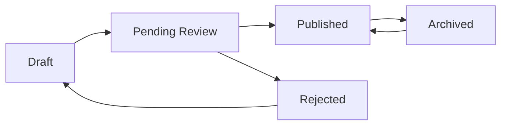

## Overview

The Posts API provides multiple endpoints to manage post states throughout their lifecycle. All state change operations require **ADMIN** role (level 2 or higher) and proper authentication.

## Authentication

**Required** - All state change endpoints require authentication with ADMIN privileges.

```bash
Authorization: Bearer YOUR_ACCESS_TOKEN
```

<Note>
  Only users with ADMIN role (level 2) or SUPER_ADMIN role (level 3) can change post states.
</Note>

---

## Change State to Pending Review

<api>PUT /api/posts/torevision</api>

Move a post to pending review state, indicating it's ready for editorial review.

### Request Body

<ParamField body="id" type="any" required>
  The unique identifier of the post to update
</ParamField>

<ParamField body="contentType" type="ContentsType" required>
  The type of content:
  - `1` - Animal
  - `2` - Advertisement
</ParamField>

### Response

<ResponseField name="success" type="boolean">
  Returns `true` when the state change is successful
</ResponseField>

### Examples

<CodeGroup>

```bash cURL
curl -X PUT https://api.rescuers.example/api/posts/torevision \
  -H "Content-Type: application/json" \
  -H "Authorization: Bearer YOUR_ACCESS_TOKEN" \
  -d '{
    "id": "post-abc123",
    "contentType": 1
  }'
```

```javascript JavaScript
const response = await fetch('https://api.rescuers.example/api/posts/torevision', {
  method: 'PUT',
  headers: {
    'Content-Type': 'application/json',
    'Authorization': 'Bearer YOUR_ACCESS_TOKEN'
  },
  body: JSON.stringify({
    id: 'post-abc123',
    contentType: 1
  })
});

const result = await response.json();
```

```python Python
import requests

url = "https://api.rescuers.example/api/posts/torevision"
headers = {
    "Content-Type": "application/json",
    "Authorization": "Bearer YOUR_ACCESS_TOKEN"
}
payload = {
    "id": "post-abc123",
    "contentType": 1
}

response = requests.put(url, json=payload, headers=headers)
result = response.json()
```

</CodeGroup>

---

## Change State to Published

<api>PUT /api/posts/topublished</api>

Publish a post, making it publicly visible on the platform.

### Request Body

<ParamField body="id" type="any" required>
  The unique identifier of the post to publish
</ParamField>

<ParamField body="contentType" type="ContentsType" required>
  The type of content:
  - `1` - Animal
  - `2` - Advertisement
</ParamField>

### Response

<ResponseField name="success" type="boolean">
  Returns `true` when the post is successfully published
</ResponseField>

### Examples

<CodeGroup>

```bash cURL
curl -X PUT https://api.rescuers.example/api/posts/topublished \
  -H "Content-Type: application/json" \
  -H "Authorization: Bearer YOUR_ACCESS_TOKEN" \
  -d '{
    "id": "post-abc123",
    "contentType": 1
  }'
```

```javascript JavaScript
const response = await fetch('https://api.rescuers.example/api/posts/topublished', {
  method: 'PUT',
  headers: {
    'Content-Type': 'application/json',
    'Authorization': 'Bearer YOUR_ACCESS_TOKEN'
  },
  body: JSON.stringify({
    id: 'post-abc123',
    contentType: 1
  })
});

const result = await response.json();
```

```python Python
import requests

url = "https://api.rescuers.example/api/posts/topublished"
headers = {
    "Content-Type": "application/json",
    "Authorization": "Bearer YOUR_ACCESS_TOKEN"
}
payload = {
    "id": "post-abc123",
    "contentType": 1
}

response = requests.put(url, json=payload, headers=headers)
result = response.json()
```

</CodeGroup>

---

## Change State to Rejected

<api>PUT /api/posts/toreject</api>

Reject a post after editorial review.

### Request Body

<ParamField body="id" type="any" required>
  The unique identifier of the post to reject
</ParamField>

<ParamField body="contentType" type="ContentsType" required>
  The type of content:
  - `1` - Animal
  - `2` - Advertisement
</ParamField>

### Response

<ResponseField name="success" type="boolean">
  Returns `true` when the post is successfully rejected
</ResponseField>

### Examples

<CodeGroup>

```bash cURL
curl -X PUT https://api.rescuers.example/api/posts/toreject \
  -H "Content-Type: application/json" \
  -H "Authorization: Bearer YOUR_ACCESS_TOKEN" \
  -d '{
    "id": "post-abc123",
    "contentType": 1
  }'
```

```javascript JavaScript
const response = await fetch('https://api.rescuers.example/api/posts/toreject', {
  method: 'PUT',
  headers: {
    'Content-Type': 'application/json',
    'Authorization': 'Bearer YOUR_ACCESS_TOKEN'
  },
  body: JSON.stringify({
    id: 'post-abc123',
    contentType: 1
  })
});

const result = await response.json();
```

```python Python
import requests

url = "https://api.rescuers.example/api/posts/toreject"
headers = {
    "Content-Type": "application/json",
    "Authorization": "Bearer YOUR_ACCESS_TOKEN"
}
payload = {
    "id": "post-abc123",
    "contentType": 1
}

response = requests.put(url, json=payload, headers=headers)
result = response.json()
```

</CodeGroup>

---

## Change State to Archived

<api>PUT /api/posts/toarchive</api>

Archive a post, removing it from public view while preserving the data.

### Request Body

<ParamField body="id" type="any" required>
  The unique identifier of the post to archive
</ParamField>

<ParamField body="contentType" type="ContentsType" required>
  The type of content:
  - `1` - Animal
  - `2` - Advertisement
</ParamField>

### Response

<ResponseField name="success" type="boolean">
  Returns `true` when the post is successfully archived
</ResponseField>

### Examples

<CodeGroup>

```bash cURL
curl -X PUT https://api.rescuers.example/api/posts/toarchive \
  -H "Content-Type: application/json" \
  -H "Authorization: Bearer YOUR_ACCESS_TOKEN" \
  -d '{
    "id": "post-abc123",
    "contentType": 1
  }'
```

```javascript JavaScript
const response = await fetch('https://api.rescuers.example/api/posts/toarchive', {
  method: 'PUT',
  headers: {
    'Content-Type': 'application/json',
    'Authorization': 'Bearer YOUR_ACCESS_TOKEN'
  },
  body: JSON.stringify({
    id: 'post-abc123',
    contentType: 1
  })
});

const result = await response.json();
```

```python Python
import requests

url = "https://api.rescuers.example/api/posts/toarchive"
headers = {
    "Content-Type": "application/json",
    "Authorization": "Bearer YOUR_ACCESS_TOKEN"
}
payload = {
    "id": "post-abc123",
    "contentType": 1
}

response = requests.put(url, json=payload, headers=headers)
result = response.json()
```

</CodeGroup>

---

## Change State to Draft

<api>PUT /api/posts/todraft</api>

Move a post back to draft state for further editing.

### Request Body

<ParamField body="id" type="any" required>
  The unique identifier of the post to move to draft
</ParamField>

<ParamField body="contentType" type="ContentsType" required>
  The type of content:
  - `1` - Animal
  - `2` - Advertisement
</ParamField>

### Response

<ResponseField name="success" type="boolean">
  Returns `true` when the post is successfully moved to draft
</ResponseField>

### Examples

<CodeGroup>

```bash cURL
curl -X PUT https://api.rescuers.example/api/posts/todraft \
  -H "Content-Type: application/json" \
  -H "Authorization: Bearer YOUR_ACCESS_TOKEN" \
  -d '{
    "id": "post-abc123",
    "contentType": 1
  }'
```

```javascript JavaScript
const response = await fetch('https://api.rescuers.example/api/posts/todraft', {
  method: 'PUT',
  headers: {
    'Content-Type': 'application/json',
    'Authorization': 'Bearer YOUR_ACCESS_TOKEN'
  },
  body: JSON.stringify({
    id: 'post-abc123',
    contentType: 1
  })
});

const result = await response.json();
```

```python Python
import requests

url = "https://api.rescuers.example/api/posts/todraft"
headers = {
    "Content-Type": "application/json",
    "Authorization": "Bearer YOUR_ACCESS_TOKEN"
}
payload = {
    "id": "post-abc123",
    "contentType": 1
}

response = requests.put(url, json=payload, headers=headers)
result = response.json()
```

</CodeGroup>

---

## Error Responses

All state change endpoints return similar error responses:

<Expandable title="401 Unauthorized">
  Authentication token is missing or invalid.
  
  ```json
  {
    "error": "Unauthorized"
  }
  ```
</Expandable>

<Expandable title="403 Forbidden">
  User does not have ADMIN privileges.
  
  ```json
  {
    "error": "Forbidden: Insufficient permissions"
  }
  ```
</Expandable>

<Expandable title="400 Bad Request">
  Request body is malformed or missing required fields.
  
  ```json
  {
    "error": "Error al actualizar"
  }
  ```
</Expandable>

<Expandable title="500 Internal Server Error">
  An unexpected error occurred on the server.
  
  ```json
  {
    "error": "Error al actualizar"
  }
  ```
</Expandable>

## State Transition Workflow

Typical post lifecycle:



1. **Draft** → **Pending Review**: Post is ready for editorial review (`/torevision`)
2. **Pending Review** → **Published**: Post is approved and published (`/topublished`)
3. **Pending Review** → **Rejected**: Post is rejected (`/toreject`)
4. **Rejected** → **Draft**: Post can be edited and resubmitted (`/todraft`)
5. **Published** → **Archived**: Post is no longer active (`/toarchive`)
6. **Archived** → **Published**: Post is reactivated (`/topublished`)

## Implementation Details

- Controller: `/workspace/source/src/controllers/animal/post.controller.ts`
- Routes: `/workspace/source/src/routes/post.route.ts:29-55`
- All endpoints use the `changeState` service method with different state parameters
- The `userId` from the authenticated user is automatically extracted and passed to track who made the change
