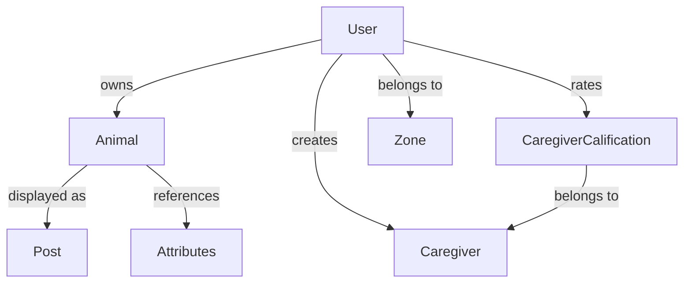

## Overview

The Rescuers API uses TypeScript interfaces to define strongly-typed data models. All entities extend the `BaseModel` interface and are stored in Firestore collections.

<Note>
  All models include an optional `id` field that is automatically populated when retrieved from Firestore.
</Note>

## Base Model

All entities inherit from the base model interface:

```typescript
export interface BaseModel {
  id?: any
}
```

The `id` field is:
- **Optional** when creating new entities
- **Automatically assigned** by Firestore on creation
- **Always present** when retrieved from the database

## Core Entities

<CardGroup cols={2}>
  <Card title="User" icon="user">
    User accounts with authentication and profile information
  </Card>
  <Card title="Animal" icon="paw">
    Animal rescue listings and lost pet reports
  </Card>
  <Card title="Caregiver" icon="heart">
    Professional caregiver profiles and services
  </Card>
  <Card title="Post" icon="newspaper">
    Unified content posts (animals, advertisements)
  </Card>
</CardGroup>

---

## User Model

**Location:** `src/models/user/iuser.interface.ts:4`

The User model represents registered users in the system with authentication and profile data.

### Interface Definition

```typescript
interface User extends BaseModel {
  name: string
  lastName: string
  email: string
  password?: string
  image: string
  contacts: IContact[]
  roles: number[]
  emailConfirmed: boolean
  emailConfirmationToken?: string
  emailVerificationAttempts: number
  zoneId: any
}
```

### Field Descriptions

<Tabs>
  <Tab title="Profile Fields">
    | Field | Type | Required | Description |
    |-------|------|----------|-------------|
    | `name` | `string` | Yes | User's first name |
    | `lastName` | `string` | Yes | User's last name |
    | `email` | `string` | Yes | Unique email address (used for login) |
    | `image` | `string` | Yes | URL to user's profile image |
    | `contacts` | `IContact[]` | Yes | Array of contact methods (phone, WhatsApp) |
    | `zoneId` | `any` | Yes | Geographic zone identifier |
  </Tab>
  
  <Tab title="Authentication">
    | Field | Type | Required | Description |
    |-------|------|----------|-------------|
    | `password` | `string` | No | Hashed password (bcrypt) - excluded from API responses |
    | `emailConfirmed` | `boolean` | Yes | Whether email has been verified |
    | `emailConfirmationToken` | `string` | No | Token for email verification and password reset |
    | `emailVerificationAttempts` | `number` | Yes | Counter for failed verification attempts (max 5) |
    | `roles` | `number[]` | Yes | Array of role IDs (see [Permissions](/concepts/permissions)) |
  </Tab>
</Tabs>

### Contact Model

**Location:** `src/models/general/icontact.model.ts:1`

```typescript
export interface IContact {
  contact: string    // Contact value (phone number, username, etc.)
  type: string       // Contact type ('whatsapp', 'phone', 'telegram', etc.)
}
```

**Example:**
```json
{
  "id": "user123",
  "name": "Juan",
  "lastName": "Pérez",
  "email": "juan@example.com",
  "image": "https://storage.googleapis.com/users/juan.jpg",
  "contacts": [
    {
      "contact": "+54911234567",
      "type": "whatsapp"
    }
  ],
  "roles": [1],
  "emailConfirmed": true,
  "emailVerificationAttempts": 0,
  "zoneId": 3
}
```

<Info>
  The `password` field is **never returned** in API responses. It's stripped by the service layer after authentication.
</Info>

---

## Animal Model

**Location:** `src/models/animals/ianimal.interface.ts:3`

The Animal model represents rescue animals or lost pets in the system.

### Interface Definition

```typescript
interface IAnimal extends BaseModel {
  name: string
  userId: string
  image?: string
  description?: string
  state: number
  lost: boolean
  atributes: string[]
}
```

### Field Descriptions

| Field | Type | Required | Description |
|-------|------|----------|-------------|
| `name` | `string` | Yes | Animal's name or identifier |
| `userId` | `string` | Yes | ID of the user who created the listing |
| `image` | `string` | No | URL to animal's photo |
| `description` | `string` | No | Detailed description of the animal |
| `state` | `number` | Yes | Post state (see [Post States](#post-states)) |
| `lost` | `boolean` | Yes | Whether this is a lost pet report |
| `atributes` | `string[]` | Yes | Array of attribute IDs (species, breed, color, size) |

### Attributes System

Animals are categorized using a flexible attribute system:

<Accordion title="Attribute Groups">
  **Location:** `src/constants/general/atributes.constant.ts`

  - **Type**: Species (dog, cat, bird, etc.)
  - **Breed**: Specific breed within species
  - **Color**: Animal coloring
  - **Size**: Physical size (small, medium, large)
  - **Gender**: Male, female, unknown
  - **Age**: Approximate age range

  Attributes are stored in the `atributes` collection and referenced by ID.
</Accordion>

**Example:**
```json
{
  "id": "animal456",
  "name": "Max",
  "userId": "user123",
  "image": "https://storage.googleapis.com/animals/max.jpg",
  "description": "Friendly golden retriever, approximately 3 years old",
  "state": 3,
  "lost": false,
  "atributes": [
    "attr_dog",
    "attr_golden_retriever",
    "attr_large",
    "attr_male"
  ]
}
```

<Note>
  When creating animals, the `state` is automatically set to `PostStates.PendingReview` (1) by the service layer.
</Note>

---

## Caregiver Model

**Location:** `src/models/user/icaregiver.model.ts:4`

The Caregiver model represents professional pet caregivers offering services.

### Interface Definition

```typescript
interface ICaregiver extends BaseModel {
  userId: string
  presentation: string
  state: PostStates
}
```

### Field Descriptions

| Field | Type | Required | Description |
|-------|------|----------|-------------|
| `userId` | `string` | Yes | ID of the user account linked to this caregiver profile |
| `presentation` | `string` | Yes | Caregiver's bio, experience, and service description |
| `state` | `PostStates` | Yes | Publication state (pending, published, archived) |

**Example:**
```json
{
  "id": "caregiver789",
  "userId": "user123",
  "presentation": "Experienced pet sitter with 5+ years caring for dogs and cats. Available for daily walks, overnight stays, and basic grooming.",
  "state": 3
}
```

### Caregiver Qualification Model

**Location:** `src/models/user/caregiverCalification.model.ts:3`

Users can rate and review caregivers:

```typescript
interface ICaregiverCalification extends BaseModel {
  caregiverId: string
  userId: string
  score: number
  comentario: string
}
```

| Field | Type | Description |
|-------|------|-------------|
| `caregiverId` | `string` | ID of the caregiver being rated |
| `userId` | `string` | ID of the user providing the rating |
| `score` | `number` | Numerical rating (typically 1-5) |
| `comentario` | `string` | Text review/comment |

---

## Post Model

**Location:** `src/models/animals/ipost.interface.ts:4`

The Post model is a **unified view** of publishable content (animals, advertisements) for displaying in feeds.

### Interface Definition

```typescript
interface IPost extends BaseModel {
  id: any
  title: string
  contentType: ContentsType
  state: PostStates
  description?: string
  image?: string
  postCategory?: string
}
```

### Field Descriptions

| Field | Type | Required | Description |
|-------|------|----------|-------------|
| `title` | `string` | Yes | Post title (animal name or content title) |
| `contentType` | `ContentsType` | Yes | Type of content (Animal = 1, Advertisement = 2) |
| `state` | `PostStates` | Yes | Publication state |
| `description` | `string` | No | Post description |
| `image` | `string` | No | Featured image URL |
| `postCategory` | `string` | No | Category label (e.g., animal type) |

<Info>
  Posts are **dynamically generated** by the `PostService` from underlying entities (animals, advertisements) rather than stored directly in the database.
</Info>

**Example:**
```json
{
  "id": "animal456",
  "title": "Max",
  "contentType": 1,
  "state": 3,
  "description": "Friendly golden retriever, approximately 3 years old",
  "image": "https://storage.googleapis.com/animals/max.jpg",
  "postCategory": "Dog"
}
```

---

## Enumerations

### Post States

**Location:** `src/constants/animals/posts.constant.ts:1`

```typescript
export enum PostStates {
  PendingReview = 1,  // Awaiting editor review
  Draft = 2,          // Work in progress, not submitted
  Published = 3,      // Approved and publicly visible
  Archived = 4,       // No longer visible publicly
  Rejected = 5,       // Reviewed and denied by editor
  Deleted = 6         // Marked for deletion
}
```

**State Transitions:**

<Steps>
  <Step title="Creation">
    New animals automatically start in `PendingReview` state
  </Step>
  
  <Step title="Review">
    Admin/editor reviews and either publishes or rejects
  </Step>
  
  <Step title="Published">
    Content becomes visible in public feeds
  </Step>
  
  <Step title="Archive/Delete">
    Owner or admin can archive or delete the post
  </Step>
</Steps>

<Note>
  Users can only change the state of their own posts. Admins (role 2) can modify any post state.
  
  See `src/services/animal/animal.service.ts:58` for state change logic.
</Note>

### Content Types

**Location:** `src/constants/animals/posts.constant.ts:11`

```typescript
export enum ContentsType {
  Animal = 1,
  Adversiment = 2  // Note: Typo in original code
}
```

---

## Model Relationships



### Relationship Details

<Tabs>
  <Tab title="User → Animal">
    **Type:** One-to-Many
    
    Each user can create multiple animal listings. The `Animal.userId` field references the owner.

    **Example Query:**
    ```typescript
    // Get all animals for a user
    const animals = await animalRepository.filter(
      { userId: 'user123' },
      'user123'
    );
    ```
  </Tab>
  
  <Tab title="User → Caregiver">
    **Type:** One-to-One
    
    Each user can have one caregiver profile. The `Caregiver.userId` field links to the user account.

    **Retrieval:**
    ```typescript
    // Get caregiver by user ID
    const caregiver = await caregiverRepository.getByUserId('user123');
    ```
  </Tab>
  
  <Tab title="Caregiver → Qualifications">
    **Type:** One-to-Many
    
    Each caregiver can have multiple ratings from different users.

    **Fields:**
    - `caregiverId`: References the caregiver
    - `userId`: References the rating author
  </Tab>
  
  <Tab title="Animal → Attributes">
    **Type:** Many-to-Many
    
    Each animal can have multiple attributes (type, breed, color, etc.). Attributes are stored in a separate collection and referenced by ID.

    **Storage:**
    ```typescript
    animal.atributes = [
      'attr_dog',
      'attr_golden_retriever',
      'attr_large'
    ]
    ```
  </Tab>
</Tabs>

---

## Repository Operations

All models support standard CRUD operations through their repositories:

### Standard Operations

**Location:** `src/interfaces/repositories/irepository.interface.ts:1`

```typescript
export interface IBaseRepository<T> {
  getAll(): Promise<T[]>
  getById(id: string): Promise<T | null>
  create(data: T, id?: string): Promise<string>
  update(id: string, data: Partial<T>): Promise<void>
  delete(id: string): Promise<void>
}
```

### Custom Repository Methods

Some repositories extend the base interface with specialized queries:

<Accordion title="User Repository">
  ```typescript
  getUserByEmail(email: string): Promise<User | undefined>
  ```
</Accordion>

<Accordion title="Caregiver Repository">
  ```typescript
  getByUserId(userId: string): Promise<ICaregiver>
  ```
</Accordion>

<Accordion title="Animal Repository">
  ```typescript
  filter(filter: IFilter | undefined, userId: any): Promise<IAnimal[]>
  count(filter: IFilter | undefined, userId: any): Promise<number>
  ```
</Accordion>

---

## Data Validation

<Warning>
  The current codebase relies on TypeScript compile-time type checking. Consider adding runtime validation with libraries like:
  - **Zod**: Schema validation
  - **class-validator**: Decorator-based validation
  - **Joi**: Object schema validation
</Warning>

### Current Validation

- **Email uniqueness**: Checked in `UserService.registerUser`
- **Email confirmation**: Token-based verification
- **Password strength**: Handled client-side (not enforced in API)
- **Required fields**: TypeScript interfaces (compile-time only)

---

## Best Practices

<CardGroup cols={2}>
  <Card title="Always use interfaces" icon="file-code">
    Reference TypeScript interfaces in service and controller signatures for type safety
  </Card>
  
  <Card title="Partial updates" icon="pen">
    Use `Partial<T>` for update operations to allow partial field updates
  </Card>
  
  <Card title="Exclude sensitive data" icon="eye-slash">
    Remove passwords and tokens before sending responses to clients
  </Card>
  
  <Card title="Validate ownership" icon="lock">
    Always verify users can only modify their own resources (unless admin)
  </Card>
</CardGroup>

---

## Next Steps

<CardGroup cols={2}>
  <Card title="Architecture" icon="diagram-project" href="/concepts/architecture">
    Learn about the MVC structure and request flow
  </Card>
  <Card title="Permissions" icon="shield" href="/concepts/permissions">
    Understand role-based access control
  </Card>
  <Card title="API Reference" icon="code" href="/api/animals/overview">
    Explore endpoints for each model
  </Card>
  <Card title="Authentication" icon="key" href="/api/auth/login">
    Implement user registration and login
  </Card>
</CardGroup>